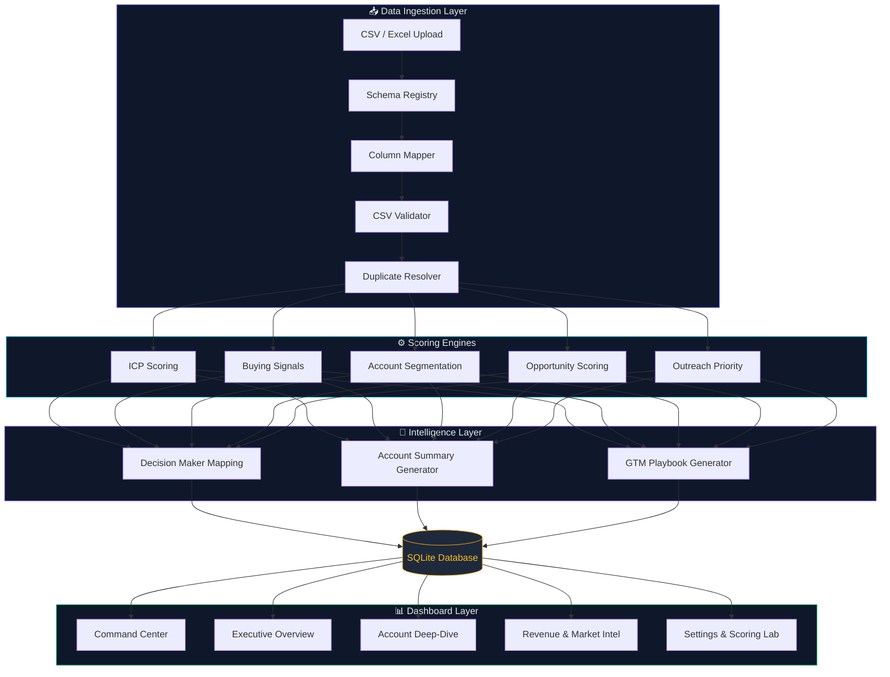

<](https://python.org)
[](https://streamlit.io)
[](https://sqlite.org)
[](https://plotly.com)
[](LICENSE)

<br/>

**A production-grade B2B SaaS Go-To-Market intelligence platform** for startup founders, RevOps teams, strategy heads, and business development professionals. Ingest any company dataset, score ideal customer fit, detect buying intent, segment accounts, map executive personas, generate outreach playbooks, and model addressable pipeline — all from a single command.

<br/>

[🚀 Quick Start](#-quick-start) · [✨ Features](#-core-features) · [🏗 Architecture](#-architecture) · [📂 Project Structure](#-project-structure) · [🧪 Testing](#-testing)

---

</div>

<br/>

## ✨ Core Features

<table>
<tr>
<td width="50%">

### 🎯 Intelligence Engines

- **ICP Scoring Engine** — Multi-factor weighted scoring (0–100) across Industry, Funding Stage, Employee Count, Hiring Intensity & Location with fully adjustable weight sliders
- **Buying Signal Detection** — Computes intent velocity from hiring waves, recent funding events & expansion status, categorized into `High` / `Medium` / `Low`
- **Unified Opportunity Score** — Blends Fit (40%), Intent (40%) & Macro Opportunity (20%) into a single prioritization index
- **ABM Tier Classification** — Auto-groups accounts into Tier 1 (High-Touch), Tier 2 (Mid-Market) & Tier 3 (Volume) segments
- **Decision Maker Mapping** — Recommends primary & secondary executive contacts based on company profile

</td>
<td width="50%">

### 📊 Analytics Dashboards

- **GTM Command Center** — Hero cockpit with actionable alert feeds, leaderboard & playbook spotlights
- **Executive Overview** — Distribution charts, ICP histograms, buying signal breakdowns & tier composition
- **Account Deep-Dive** — Searchable priority grid with inline AI summaries, scoring breakdowns & custom playbooks
- **Revenue & Market Intelligence** — ACV pipeline simulation, ICP × Buying Signal quadrant plots & market potential modeling
- **Settings & Scoring Lab** — Live weight configurator, scoring recalculation & factor-level breakdowns

</td>
</tr>
</table>

<br/>

<table>
<tr>
<td width="50%">

### 🔄 Data Ingestion 2.0

- **Guided Onboarding Wizard** — Step-by-step CSV upload → column mapping → validation → duplicate detection → scoring
- **Smart Column Mapper** — Auto-detects 60+ header aliases and maps to canonical schema
- **Schema Registry** — Centralized column definitions with normalization for funding stages, locations & activity levels
- **Dataset Health Auditor** — Validates completeness, identifies missing values & flags scoring anomalies
- **Duplicate Resolver** — Detects & resolves duplicate company records with configurable strategies

</td>
<td width="50%">

### 🛠 Workspace Management

- **Multi-Batch Architecture** — Upload, store & compare multiple datasets side-by-side
- **Batch Activation** — Toggle active datasets to instantly switch dashboard context
- **Rename / Clone / Delete** — Full workspace lifecycle controls for every ingested batch
- **Excel & CSV Export** — One-click download of scored results with all computed fields
- **Persistent SQLite Storage** — All data survives restarts via a local database

</td>
</tr>
</table>

<br/>

---

<br/>

## 🏗 Architecture



<br/>

---

<br/>

## 📂 Project Structure

```
enterprise-gtm-account-intelligence-platform/
│
├── 📄 app.py                           # Main entry — routing, sidebar, onboarding wizard
│
├── 🧠 core/                            # Scoring & intelligence engines
│   ├── icp_scoring.py                     # Weighted ICP fit score (0–100)
│   ├── buying_signals.py                  # Hiring/funding/expansion intent (0–100)
│   ├── tiering.py                         # ABM tier classification (T1 / T2 / T3)
│   ├── opportunity_scoring.py             # Unified GTM opportunity index
│   ├── outreach_engine.py                 # Outreach priority & justification
│   ├── decision_maker_mapping.py          # Executive persona recommendations
│   ├── account_segmentation.py            # Firmographic segmentation
│   ├── account_summary.py                 # Natural-language account briefs
│   └── gtm_playbook_generator.py          # Multi-step outreach playbooks
│
├── 📊 dashboard/                        # UI presentation modules
│   ├── gtm_command_center.py              # Hero cockpit & leaderboard
│   ├── overview.py                        # Executive analytics & distributions
│   ├── account_analysis.py                # Searchable grid & deep-dive inspector
│   ├── revenue_market_intelligence.py     # ACV simulation & quadrant plots
│   └── settings_scoring.py                # Weight configurator & scoring lab
│
├── 🗄️ database/                         # Persistence layer
│   └── database.py                        # SQLite CRUD, batch ops, activation
│
├── 🔧 utils/                            # Shared utilities
│   ├── constants.py                       # CSS themes, default weights, SVG icons
│   ├── helpers.py                         # Export helpers, HTML sanitization, generators
│   ├── schema_registry.py                 # Canonical columns, aliases, normalizations
│   ├── column_mapper.py                   # Auto-maps raw headers → canonical schema
│   ├── csv_validator.py                   # Data health auditing & scoring sanity checks
│   └── duplicate_detector.py              # Duplicate detection & resolution
│
├── 🧪 tests/                            # Test suite
│   └── test_ingestion_2_0.py              # Ingestion pipeline unit tests
│
├── 📁 data/                             # Sample datasets
│   └── sample_companies.csv               # 100 pre-populated startup profiles
│
├── 🎨 assets/                           # Branding
│   └── logo.png                           # Platform logo
│
├── 📋 requirements.txt                  # Python dependencies
└── 📘 README.md                         # You are here
```

<br/>

---

<br/>

## 🚀 Quick Start

### Prerequisites

| Requirement | Version |
|:--|:--|
| Python | `3.8+` |
| pip | Latest |

### Installation

```bash
# 1 · Clone the repository
git clone https://github.com/your-org/enterprise-gtm-account-intelligence-platform.git
cd enterprise-gtm-account-intelligence-platform

# 2 · Create a virtual environment (recommended)
python -m venv .venv
source .venv/bin/activate        # macOS / Linux
.venv\Scripts\activate           # Windows

# 3 · Install dependencies
pip install -r requirements.txt

# 4 · Launch the platform
streamlit run app.py
```

The platform opens automatically at **`http://localhost:8501`**.

<br/>

---

<br/>

## 📖 Usage Guide

<details>
<summary><strong>1 · Load Sample Data</strong></summary>
<br/>

On first boot, click **"Load Demo Dataset (100 Startups)"** in the sidebar. This instantly processes all 100 accounts through every scoring engine and populates all dashboard views.

</details>

<details>
<summary><strong>2 · Upload Your Own Dataset</strong></summary>
<br/>

Navigate to **Data Integration** → drag and drop any company CSV. The onboarding wizard walks you through:

1. **Column Mapping** — Auto-detects headers; manually override if needed
2. **Data Validation** — Audits completeness and normalizes values
3. **Duplicate Resolution** — Flags and resolves duplicate records
4. **Scoring & Indexing** — Runs all engines and stores results

</details>

<details>
<summary><strong>3 · Customize Scoring Weights</strong></summary>
<br/>

Open the sidebar weight configurator and adjust factor allocations:

| Factor | Default Weight |
|:--|:--|
| Industry Match | 25 |
| Funding Stage | 25 |
| Employee Count | 20 |
| Hiring Activity | 15 |
| Location | 15 |

Click **"Recalculate Scoring Fits"** to re-score the entire dataset with new weights.

</details>

<details>
<summary><strong>4 · Deep-Dive into Accounts</strong></summary>
<br/>

Navigate to **Account Prioritization** → use the search bar and multi-select filters → select any account to view:

- Full ICP scoring breakdown
- Buying signal analysis
- Decision maker recommendations
- AI-generated account summary
- Custom GTM playbook

</details>

<details>
<summary><strong>5 · Model Revenue Scenarios</strong></summary>
<br/>

Open **Revenue & Market Intelligence** → enter custom ACV values per segment → visualize:

- Addressable pipeline by tier
- ICP × Buying Signal quadrant chart (Sweet Spot / Intent Wave / Long-term Fit / Cold)
- Market opportunity heatmaps

</details>

<br/>

---

<br/>

## 🧪 Testing

```bash
# Run the full test suite
python -m unittest tests/test_ingestion_2_0.py

# Or using pytest
pytest tests/ -v
```

The test suite validates:

- ✅ Schema registry & column alias resolution
- ✅ CSV validation & normalization pipeline
- ✅ Duplicate detection algorithms
- ✅ SQLite batch CRUD operations
- ✅ Scoring engine calculations

<br/>

---

<br/>

## 🧰 Tech Stack

<div align="center">

| Layer | Technology | Purpose |
|:--|:--|:--|
| **Frontend** | Streamlit | Interactive SaaS-style web UI |
| **Visualization** | Plotly | Dynamic charts, heatmaps & quadrants |
| **Scoring** | Python / NumPy | Multi-factor weighted calculations |
| **Data** | Pandas | DataFrame manipulation & analysis |
| **Storage** | SQLite | Persistent batch & company storage |
| **ML** | scikit-learn | Clustering & advanced segmentation |
| **Export** | openpyxl | Excel workbook generation |

</div>

<br/>

---

<br/>

## 🧬 Scoring Model

```
┌─────────────────────────────────────────────────────────────────────┐
│                    Unified GTM Opportunity Score                    │
├─────────────────────────────────────────────────────────────────────┤
│                                                                     │
│   ┌───────────────┐  ┌───────────────┐  ┌───────────────────────┐  │
│   │  ICP Fit (40%) │  │ Intent (40%)  │  │ Macro Opportunity(20%)│  │
│   ├───────────────┤  ├───────────────┤  ├───────────────────────┤  │
│   │ • Industry    │  │ • Hiring Wave │  │ • Market Trend Score  │  │
│   │ • Funding     │  │ • Funding Evt │  │ • Segment Growth      │  │
│   │ • Employees   │  │ • Expansion   │  │ • Competitive Density │  │
│   │ • Hiring      │  │               │  │                       │  │
│   │ • Location    │  │               │  │                       │  │
│   └───────────────┘  └───────────────┘  └───────────────────────┘  │
│                                                                     │
│                     ▼ Weighted Composite ▼                          │
│                                                                     │
│          ┌─────────────────────────────────────┐                    │
│          │ Exceptional │ High │ Moderate │ Low │                    │
│          │   80–100    │60–79 │  40–59   │ 0–39│                    │
│          └─────────────────────────────────────┘                    │
│                                                                     │
│                     ▼ Classification ▼                              │
│                                                                     │
│          ┌──────────┐  ┌──────────┐  ┌──────────┐                  │
│          │  Tier 1  │  │  Tier 2  │  │  Tier 3  │                  │
│          │High-Touch│  │Mid-Market│  │  Volume  │                  │
│          └──────────┘  └──────────┘  └──────────┘                  │
└─────────────────────────────────────────────────────────────────────┘
```

<br/>

---

<br/>

## 📄 CSV Schema Reference

Your uploaded CSV should contain headers matching (or aliasing to) the canonical schema:

| Canonical Column | Example Aliases | Example Values |
|:--|:--|:--|
| `Company Name` | `company`, `name`, `co` | Stripe, Notion, Figma |
| `Industry` | `sector`, `vertical` | SaaS, FinTech, HealthTech |
| `Funding Stage` | `stage`, `round` | Seed, Series A, Series B, Growth |
| `Employee Count` | `employees`, `headcount`, `size` | 1–10, 11–50, 51–200, 201–500, 500+ |
| `Location` | `country`, `city`, `hq` | US, UK, India, Germany |
| `Hiring Activity` | `hiring`, `open_roles` | Aggressive, Moderate, Slow, Frozen |
| `Recent Funding` | `recently_funded` | Yes, No |
| `Expansion Status` | `growth`, `expansion` | Expanding, Stable, Contracting |

> **💡 Tip:** The platform auto-detects 60+ header variations — no manual renaming needed in most cases.

<br/>

---

<br/>

<div align="center">

Built with precision for the modern GTM stack.

**[⬆ Back to Top](#enterprise-gtm-account-intelligence-platform)**

</div>
]]>
