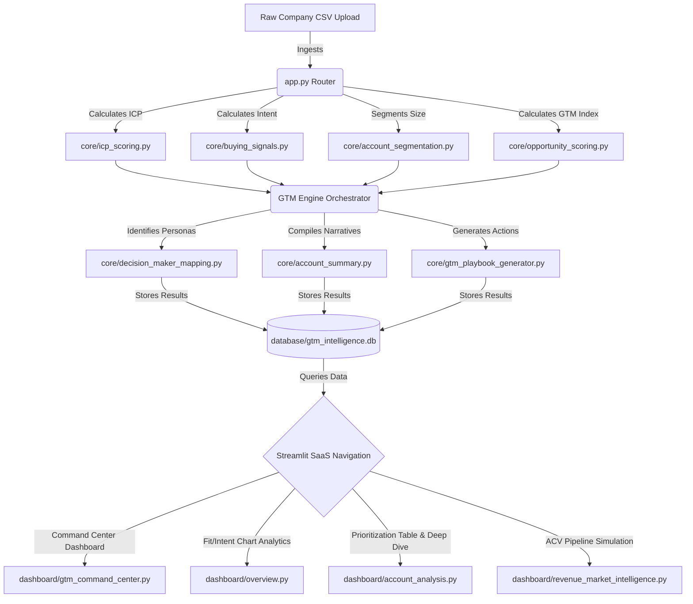

# Enterprise GTM Account Intelligence Platform

A production-grade, professional B2B SaaS-style Go-To-Market (GTM) intelligence platform used by startup founders, RevOps, strategy heads, and business development teams. This platform automates data ingestion, processes multi-factor fits, predicts buying intent, segments accounts, identifies executive personas, maps custom GTM playbooks, and simulates addressable revenue.

Designed with clean typography, dynamic SaaS weight configurators, interactive visual dashboards, and custom styling to emulate high-end platforms like Apollo, Clay, HubSpot, and Salesforce.

---

## ⚡ Main Core Features

1. **GTM Command Center (Hero Dashboard)**: Actionable alert feeds displaying accounts requiring immediate outreach, high-opportunity segment matrices, and playbook spotlight workflows.
2. **ICP Scoring Engine**: Dynamic weighted calculation model (0-100) scoring customer profile fit across Industry match, Funding Stage, Employee ranges, hiring intensity, and Location.
3. **ABM Tiering Engine**: Automatic grouping of accounts into high-touch Tier 1, mid-market Tier 2, and volume Tier 3 segments based on ICP score thresholds.
4. **Buying Signal Intent Engine**: Computes interest speed (0-100) based on active hiring waves, recent funding events, and team footprint expansions, categorizing signals into `High`, `Medium`, and `Low`.
5. **Unified GTM Opportunity Score**: Blends Fit (40% ICP Score), Intent (40% Buying Signal Score), and Macro Opportunity (20% Market Trend Score) to generate a combined prioritization index (Exceptional, High, Moderate, Low).
6. **Decision Maker Mapping**: Recommends primary and secondary target executive contacts (Founder, CEO, VP People, VP Operations, etc.) based on size, vertical, and hiring velocity.
7. **AI Account Summary Engine**: Generates concise, natural-language account intelligence briefs highlighting firmographics, priority levels, and outreach targets.
8. **GTM Playbook Generator**: Automatically produces tailored, multi-step GTM outreach steps (LinkedIn sequences, targeted ad groups, custom demo offers).
9. **Account Intelligence PRIORITIZATION Grid**: Excel-style interactive table supporting live keyword search, multi-select filters, custom column sorting, Excel/CSV exporting, and deep-dive audits.
10. **Revenue & Market Simulator**: Interactive dashboard modeling addressable pipeline values based on custom segment ACV entries. Plots ICP vs. Buying Signal quadrant charts (Sweet Spot, Intent Wave, Long-term Fit, Cold).

---

## 🏗 System Architecture & Data Flow



---

## 📂 Folder Structure

```text
enterprise-gtm-account-intelligence-platform/
│
├── app.py                      # Main entry point, page router & sidebar weights config
│
├── core/                       # Scoring, segmentation, and outreach logic engines
│   ├── icp_scoring.py             # Calculates weighted ICP fit score (0-100)
│   ├── buying_signals.py          # Evaluates hiring, funding, expansion status (0-100)
│   ├── tiering.py                 # Groups accounts into ABM Tier 1, 2, or 3
│   ├── outreach_engine.py         # Assigns outreach priority levels & justifications
│   ├── decision_maker_mapping.py  # Recommends primary/secondary contact contacts
│   ├── opportunity_scoring.py     # Combines ICP, Buying, & Market scores (0-100)
│   ├── account_summary.py         # Generates narrative AI account profiles
│   ├── account_segmentation.py    # Firmographic categorization (Enterprise, Mid-market, SMB, Startup)
│   └── gtm_playbook_generator.py  # Maps customized outreach action plays
│
├── dashboard/                  # UI presentation layers
│   ├── gtm_command_center.py      # Hero cockpit (immediate plays, leaderboard)
│   ├── overview.py                # Executive charts, distributions, & stats
│   ├── account_analysis.py        # Searchable priority grid & Deep-Dive auditor
│   └── revenue_market_intelligence.py # ACV market potential calculations & quadrant plot
│
├── database/                   # SQLite Storage Layer
│   └── database.py                # Handles database connection, batch saves, and deletions
│
├── utils/                      # Configurations & helpers
│   ├── constants.py               # CSS themes, default weights, metadata structures
│   └── helpers.py                 # File exports, dataset generators, HTML badges
│
├── data/                       # Local file storage
│   └── sample_companies.csv       # Pre-populated realistic startup profiles
│
├── assets/                     # Media & Logos
│   └── logo.png                   # Premium GTM brand logo
│
├── requirements.txt            # Python dependencies
└── README.md                   # Platform documentation
```

---

## 🚀 Installation & Local Running

### Prerequisites
- Python 3.8 or higher.
- `pip` package installer.

### Steps
1. **Clone or Navigate to the Workspace Directory**:
   ```bash
   cd "e:\Enterprise GTM"
   ```

2. **Install Required Libraries**:
   ```bash
   pip install -r requirements.txt
   ```

3. **Launch the Platform Locally**:
   ```bash
   streamlit run app.py
   ```

The Streamlit web server will boot and automatically open the application in your default browser at `http://localhost:8501`.

---

## 💡 Quick Start Guide
1. **Load Sample Data**: If the platform has no data on first boot, click **"Load Demo Dataset (100 Startups)"** in the sidebar. This immediately calculates all scores and visualizes the command center.
2. **Upload Custom Files**: Drag and drop any company CSV matching the expected structure. Click **"Process & Index CSV"** to save a new batch.
3. **Change Weights Dynamic Customization**: Change the sliders in the sidebar (e.g. set Industry Weight to 40, Location Weight to 20). Click **"Recalculate Scoring Fits"** to dynamically update scores across the database batch.
4. **Audit an Account**: Navigate to the **"Account Prioritization"** page, click the **"Select Account to Audit"** dropdown in the deep-dive inspector, and analyze the custom AI brief and playbook target plays.

---

## 💼 Resume Positioning Guide

Use this project to showcase strategic revenue operations, sales engineering, growth strategy, and product intelligence capabilities in interviews.

**Key bullets you can put on your Resume:**
> **Enterprise GTM Account Intelligence Platform**
> *Python • Streamlit • SQLite • ICP Development • ABM • Sales Analytics*
> - Engineered an enterprise-grade Go-To-Market (GTM) account intelligence platform evaluating 100+ target startup accounts across ICP alignment, buying intent velocity, and macro-market opportunities.
> - Built modular Python scoring engines mapping 5-factor ICP fits, 3-factor buying signal levels, and unified GTM opportunity scores to prioritize high-value pipelines.
> - Designed a firmographic segmentation classifier and SQLite persistence layer grouping accounts (Enterprise, Mid-Market, SMB, Startup) with batch comparison controls.
> - Implemented contact mapping decision algorithms recommending primary/secondary executive buyer personas (Founder, CEO, VP People, etc.) along with natural-language AI summaries.
> - Developed interactive executive analytics dashboards using Streamlit and Plotly to visualize alignment heatmaps, opportunity quadrants, and pipeline ACV estimates.
